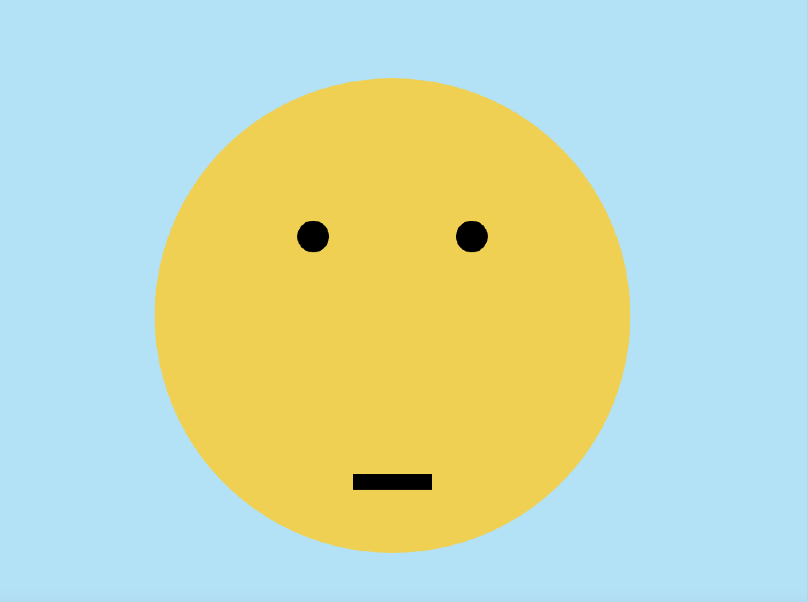

# parnp401_creativecoding_2020: Sound & Polygons

Based on the smileys of the previous assignment, I am now adding polygons and sounds. You can watch the final version on Youtube.

## Smiley
This is a sad face.

void ofApp::draw(){
    ofBackground(179, 225, 245);

    ofSetColor(239,208,82);
    ofFill();
    ofDrawCircle(500,400,300);

    ofSetColor(0,0,0);
    ofFill();
    ofDrawCircle(400,300,20);

    ofSetColor(0,0,0);
    ofFill();
    ofDrawCircle(600,300,20);

    ofSetColor(0,0,0);
    ofFill();
    ofDrawCurve(500,400,400,600,600,600,1500,1500);
       
    
}

