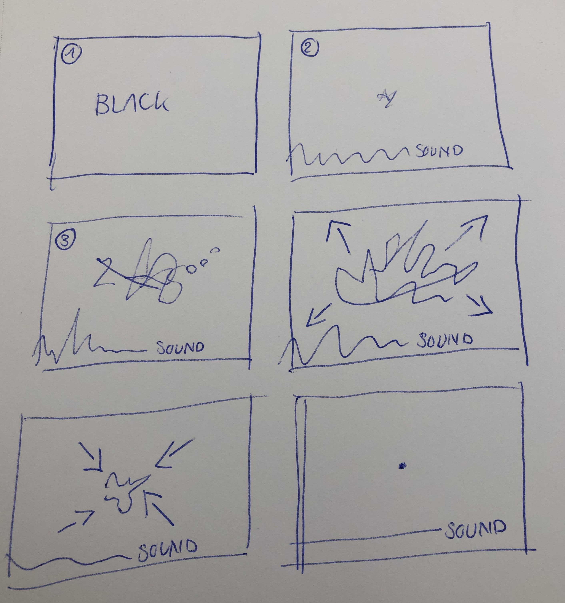
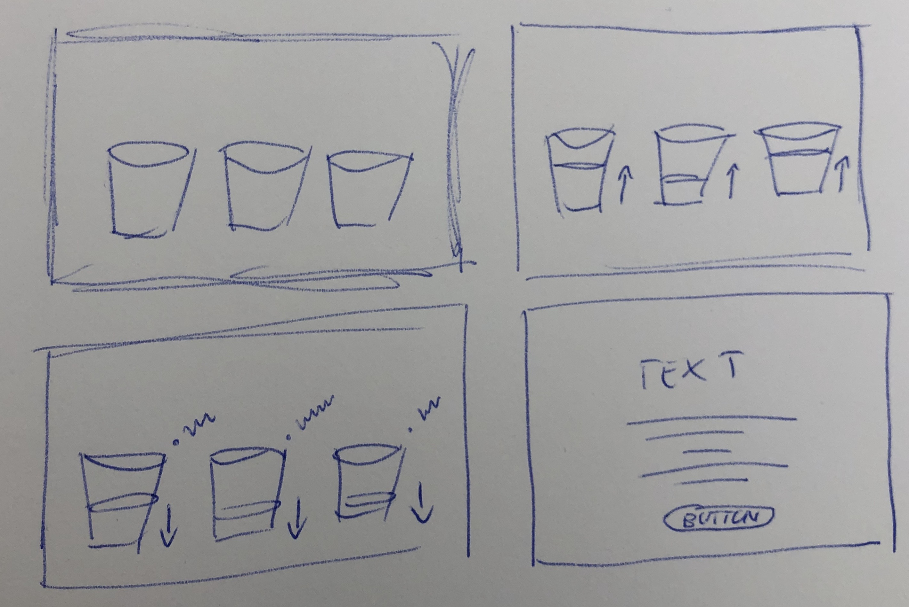
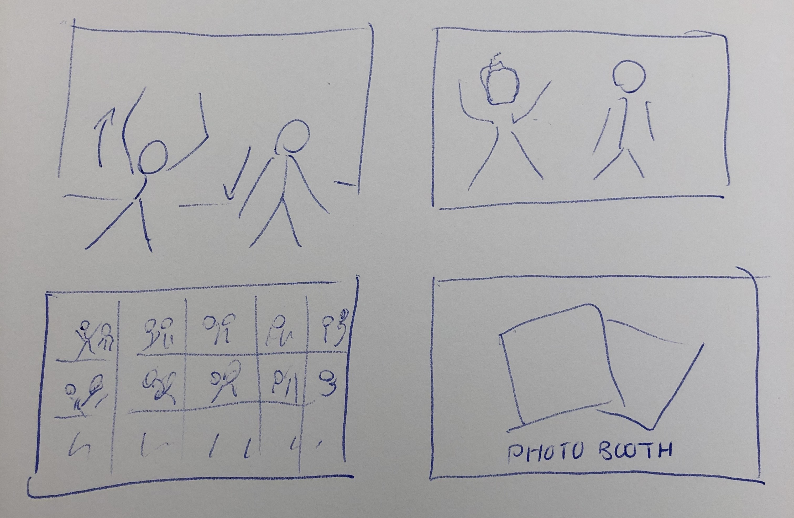

# Assignment 3

The details of my projects are still flexible and very likely to change. 

## Project 1: Synaesthesia ##

The first project is all about Synaesthesia, a neurological phenomenom that combines colors with senses. The visual effect in the head is different everytime it happens, yet the color scheme is limited and cannot be affected by the person. This is the perfect starting point for a generative design project with sound. 

### 1. Who is the user? ###

The target group of this project are students between 17 and 28, who don't know anything about synaesthesia. Hopefully, some will realize that they actually have synaesthesia, which happened to me too. 

### 2. What do you want them to experience? ###

I want them to experience the generative effects of synaesthesia in an interactive way. Users will be able to interact using sound, words and numbers. The key learning should be: Synaesthesia is different for every person who has it and even for 

### 3. How will your translation achieve this? ###

Users can affect the outcome by adding sound or typing letters or words. They can also change the view, which allows them to look inside the brain of a person with synaesthesia. 

## Project 2: Data out of Trash ##

### 1. Who is the user? ###

The age of the user doesn't matter, as long as the user is able to read. The most important attribute is awareness for the environment. The perfect user is passionate about sustainability, but doesn't know any data related to trash.  

### 2. What do you want them to experience? ###

Usually, people don't care about garbage after throwing it away. Therefore, the aim of this project is to visualize the amount of garbage produced in a specific region, based on the data given. They should rethink their own behaviour and eventually contribute to recycling. 

### 3. How will your translation achieve this? ###

With the help of a sophisticated data source, the project is able to not only visualize data in bins, but also to provide additional information for the user. 

## Project 3: Photo Booth ##

### 1. Who is the user? ###

This project is dedicated to students who spend time on D12 and are looking for a study break. The OpenFramework Photobooth is the perfect way to take photos and create creative collages. 

### 2. What do you want them to experience? ###

I want them to experience a feeling of connectedness and fun while interacting with the prijection. It involves a webcam or another camera and will turn photos instantly into a unique collection of memories that they can share with friends. 

### 3. How will your translation achieve this? ###

Webcams can take as many pictures as posible in a short amount of time and can collect them directly on the screen in a random order, maybe even with filters or random visual effects. A version with short videos is also possible. 

## Weekly Project ##

### Team 2: ### 
ofDrawEllipse() 
ofDrawLine() 
ofDrawRectangle() 
ofGetFrameNum()

