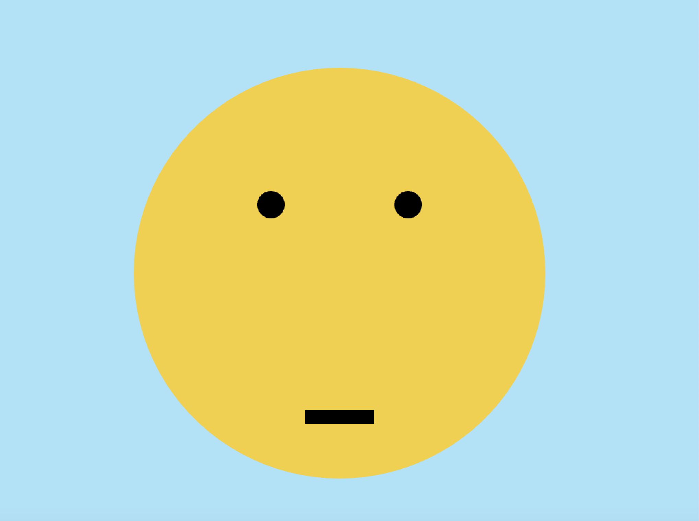
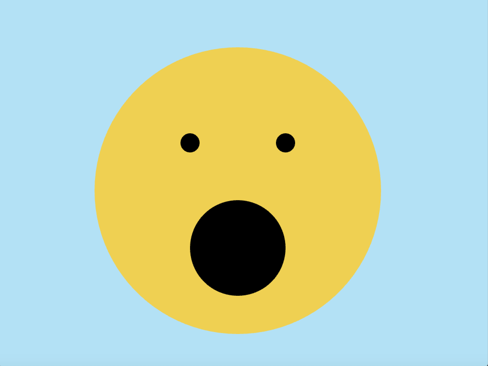
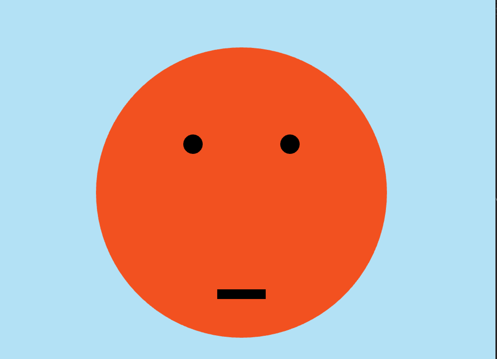

# parnp401_creativecoding_2020: Emotions

## 1. Happiness ##
This is a smiling face. 
    
## 2. Sadness
This is a sad face.

void ofApp::draw(){
    ofBackground(179, 225, 245);

    ofSetColor(239,208,82);
    ofFill();
    ofDrawCircle(500,400,300);

    ofSetColor(0,0,0);
    ofFill();
    ofDrawCircle(400,300,20);

    ofSetColor(0,0,0);
    ofFill();
    ofDrawCircle(600,300,20);

    ofSetColor(0,0,0);
    ofFill();
    ofDrawRectangle(450,600,100,20);

## 3. Surprise ##
The surprising face is showing an open mouth. 

void ofApp::draw(){
    ofBackground(179, 225, 245);

    ofSetColor(239,208,82);
    ofFill();
    ofDrawCircle(500,400,300);
    
    ofSetColor(0,0,0);
    ofFill();
    ofDrawCircle(400,300,20);
    
    ofSetColor(0,0,0);
    ofFill();
    ofDrawCircle(600,300,20);
    
    ofSetColor(0,0,0);
    ofFill();
    ofDrawCircle(500,520,100);
    
## 4. Anger ##
Anger is expressed by adding eyebrows and changing color.

void ofApp::draw(){
    ofBackground(179, 225, 245);

    ofSetColor(242,81,32);
    ofFill();
    ofDrawCircle(500,400,300);
    
    ofSetColor(0,0,0);
    ofFill();
    ofDrawCircle(400,300,20);
    
    ofSetColor(0,0,0);
    ofFill();
    ofDrawCircle(600,300,20);
    
    ofSetColor(0,0,0);
    ofFill();
    ofDrawRectangle(450,600,100,20);
